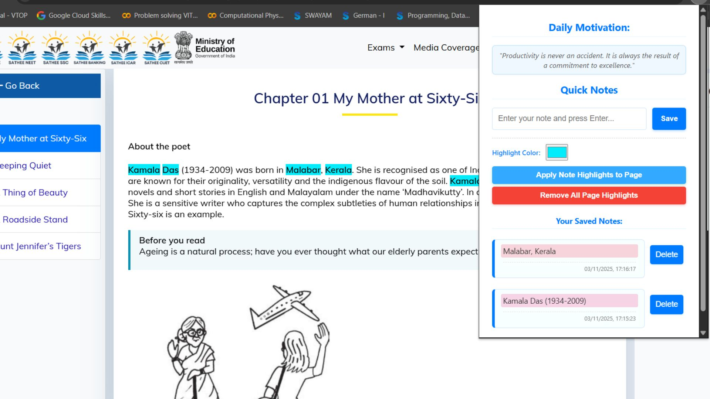
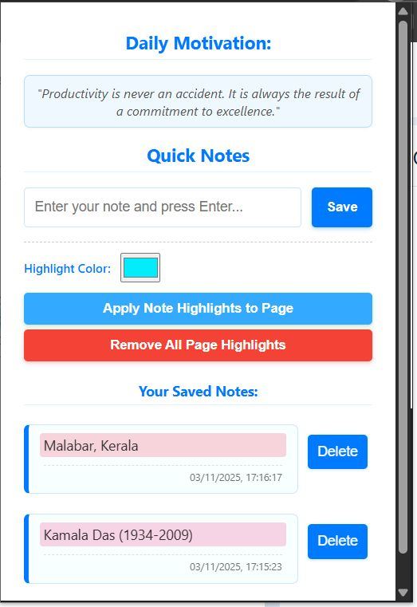

# Quick-Notes-Chrome-Extension
A simple and very useful Note Extension for the students

<h2>Problem Statement</h2>

While reading online, you cannot highlight on the webpage or neither you can keep as note.

<h2>Solution</h2>

I made a Quick Notes, a Chrome extension that works for the note-taking and highlighting important concepts or stuff in the real-time on the webpages. It shows the time and date at which the notes were saved. Also, you can use different colours to highlight the text. Everytime when you open the Quick Notes it will keep you motivated with different thoughts.

<h3>TechStack Used</h3>
To make this Chrome Extension, I used :- 
1) JavaScript 
2) HTML 
3) CSS 
4) MANIFEST
<h3>How to Use it</h3>
To use the Quick Notes, follow the steps:- 
1) Download the Quick Notes files from my GitHub 
2) Save it in one folder 
3) Go to your Chrome Manage Extension settings -> On Developer Mode -> Click on Load Unpacked -> Select your folder where you saved your extension files  
4) Now it will be added to your Chrome Extension, and you can use it.
<h4>Note:</h4>

If you turn off the developer mode, you will not be able to use it,  you need to keep the developer mode on to use this Quick Notes Extension.

 

